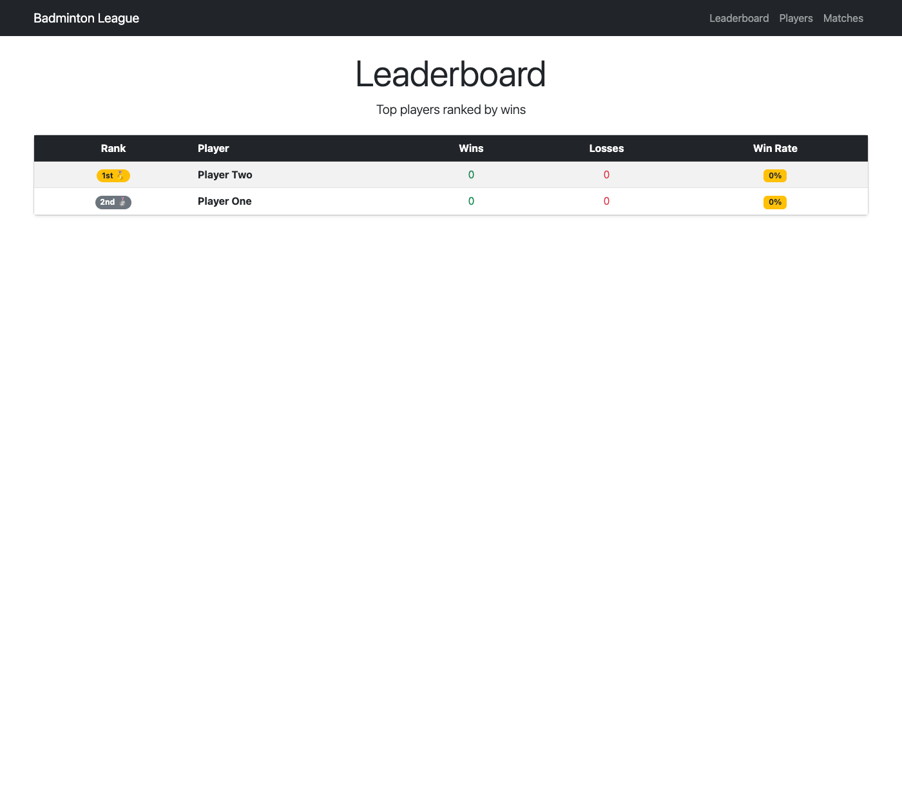
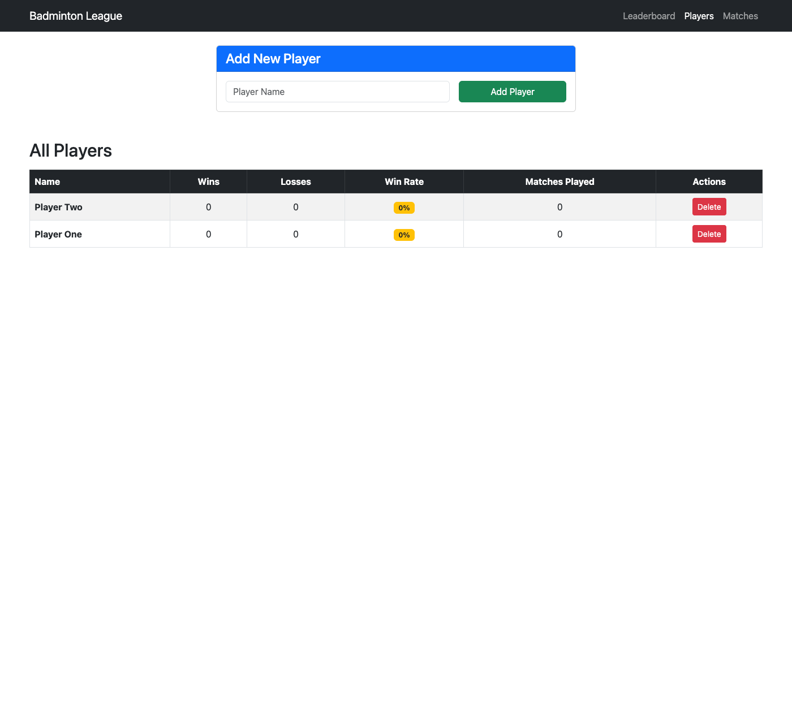
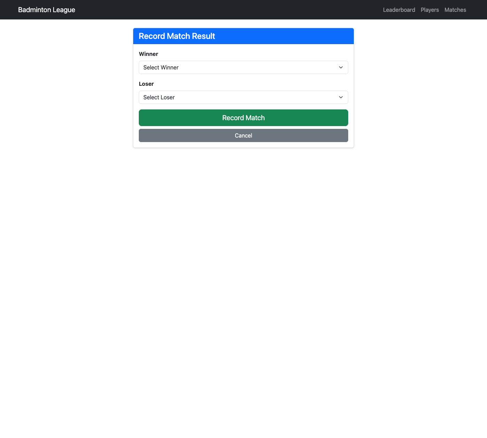
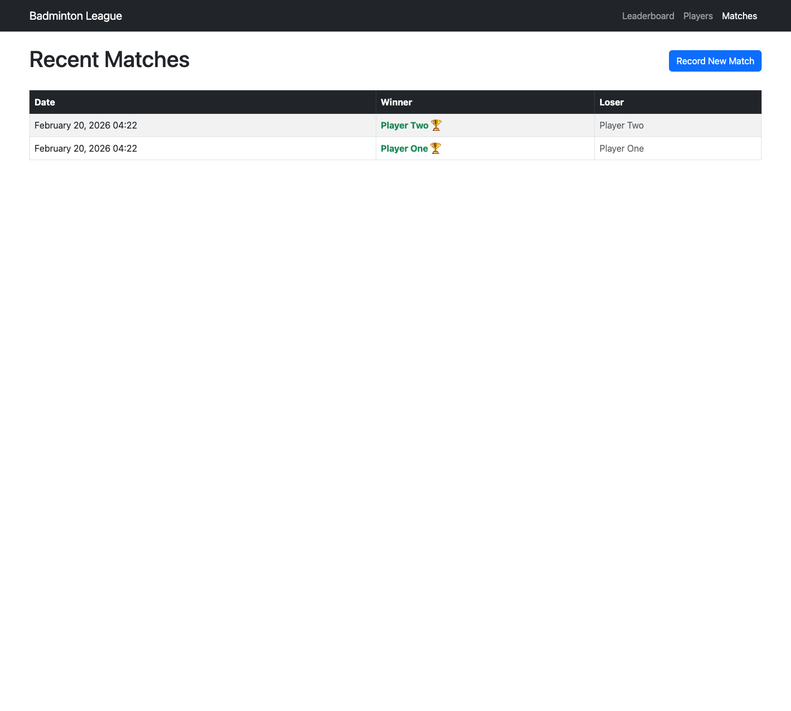

# Badminton League Manager

A Ruby on Rails application to manage a badminton league, tailored for tracking player statistics, recording match results, and viewing a dynamic leaderboard.

## Features

*   **Player Management**: Add, view, and delete players.
*   **Match Recording**: Record matches between two players.
*   **Automated Stats**: Wins and losses are automatically updated for each player.
*   **Leaderboard**: View players ranked by wins (primary) and losses (secondary).
*   **Responsive UI**: Built with Bootstrap 5 for a modern, mobile-friendly interface.

## Screenshots

### Leaderboard
The main dashboard showing player rankings.


### Players List
Manage all players in the league.


### Record a Match
Easily record match results.


### Recent Matches
View a history of all played matches.


## Getting Started

### Prerequisites
*   Ruby 3.x
*   Rails 8.x
*   SQLite3

### Installation

1.  Clone the repository:
    ```bash
    git clone https://github.com/arshtandon121/arshdeep_assignment_finmet.io.git
    cd arshdeep_assignment_finmet.io
    ```

2.  Install dependencies:
    ```bash
    bundle install
    ```

3.  Setup the database:
    ```bash
    rails db:migrate
    ```

4.  Start the server:
    ```bash
    rails server
    ```

5.  Open your browser and navigate to `http://localhost:3000`.

## Testing

Run the test suite to ensure everything is working correctly:
```bash
rails test
```
